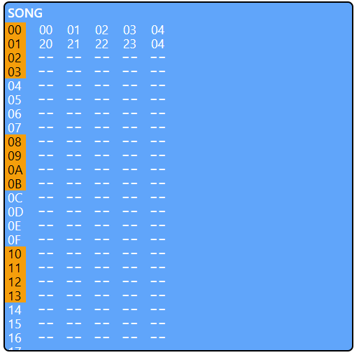



## Inledning

Denna uppsats handlar om mitt examensarbete där jag gjorde en webbapp kallad Nejime^[Japanska 音締め, att stämma ett instrument, speciellt shamisen. Direkt översatt "dra åt ljud".] som är till för att göra musik i en browser. Appen är en mycket simplifierad version av programmet LSDj på Gameboy som är en tracker^[En tracker är mjukvara för att skapa musik där användaren placerar ljud i rutnät. Varje rad representerar en tidsenhet och varje kolumn representerar en ljudkanal.].



## Bakgrund

Jag är intresserad av musik och tänkte att det kunde vara intressant att göra ett examensarbete som är relaterat till musik. Sedan tidigare kände jag till programmet LSDj på Gameboy och tänkte att jag kunde göra en webbsida med en mycket simplifierad version av det programmet.

Jag valde att skapa appen med Svelte 5 som är den senaste versionen av Javascriptramverket Svelte som kommer ha en officiell release troligt senare detta år. Svelte är känt för en simpel HTML och Javascript-liknande syntax och för att vara ett kompilerat ramverk vilket betyder att det ger väldigt bra prestanda. Jag har använt Svelte tidigare i skolarbete men fick använda React på LIA och de sista kurserna så jag ville testa Svelte igen och kände att det var en perfekt timing att testa Svelte 5 som tydligen ska göra vissa saker (t.ex state utanför komponenter) lättare.

## Syfte

Jag har flera syften med examensarbetet:

- Skapa ett projekt som senare kan bli ett större sidoprojekt. Jag förväntade mig inte att programmet skulle vara helt perfekt efter sex veckor utan att det skulle bli en grund som senare kan förbättras och utvecklas vidare. Speciellt genom opensource för jag kan tänka mig att andra kan bli intresserade av projektet när det har blivit mer komplett.

- Börja lära mig Svelte 5.

- Utmana mig själv genom att göra något som inte bara är en vanlig webbsida. Jag har aldrig gjort något liknande i komplexitet tidigare vilket betyder att det var svårt men också väldigt givande.

## Mål

Mitt främsta mål var att göra en app för att enkelt skapa musik i en webbläsare. Fokuset med denna första version var att det skulle vara smidigt och snabbt att använda och att enkelt göra musikskisser och testa olika idéer.

## Utvecklingsmiljö

Min utvecklingsmiljö var [Svelte 5](https://svelte-5-preview.vercel.app/docs/introduction) och appramverket [SvelteKit](https://kit.svelte.dev/) vilket använder [Vite](https://vitejs.dev/) som är känt för snabba uppdateringar efter kodändringar.

Jag använder också Typescript för att lättare se om jag gör fel.

Jag använder VSCode som fungerar perfekt för mig för webbutveckling.

## Krav

Nejime var mitt eget projekt så jag kunde sätta egna krav. Jag hade bara två enkla krav, att man ska kunna göra musik som kan spelas upp och att appen ska kännas enkel och smidig att använda.

## Planering

Istället för att spendera mycket tid att skapa krav, user stories och tasks som jag kände var litet overkill när man är själv valde jag att ha en todofil med hjälp av en VSCode-extension [Todo+](https://marketplace.visualstudio.com/items?itemName=fabiospampinato.vscode-todo-plus) där jag kunde lägga till saker som behöver göras och markera när de är klara. Detta gjorde att jag kunde spendera mer tid att faktiskt koda som var något jag kände behövdes eftersom det för mig var ett svårt projekt.

En annan anledning var att jag inte visste hur långt jag skulle hinna och det kändes onödigt att teorisera för mycket om saker jag kanske inte hann göra ändå. Todofilen gjorde att jag enkelt kunde göra små fokuserade tasks som jag kunde göra, sedan markera när de var klara och lägga till nya todos för att utöka funktionaliteten.

## Teknisk beskrivning

### Kort beskrivning av appen

Appen är uppbyggd av sidor och komponenter. Det finns två sidor eller routes (definierade av `+page.svelte`), en index-route och en dynamisk route för att ladda sångdata från länkar. Appen använder biblioteket [smplr](https://github.com/danigb/smplr) för att spela upp ljud genom Web Audio API.

Sidan importerar och visar en komponent som heter Nejime.svelte. Denna komponent är en ruta som alltid visas som hanterar funktioner som playback med spacebar och navigation mellan olika view-states som `song`, `pattern` och `phrase`. När view-statet ändras visas komponenten för det statet, t.ex Song.svelte för song, Pattern.svelte för pattern osv.

Song innehåller `patterns`. Patterns innehåller `phrases`. Phrases innehåller `notes`. Man kan tänka sig att song är en hel sång med alla kanaler och alla patterns för varje kanal, pattern är ett musikstycke uppbyggt av flera phrases och varje phrase kan ha flera noter.

Detta gör appen väldigt effektiv för att testa olika musikaliska idéer för man kan enkelt ändra ordningen av phrases i ett pattern. T.ex om man har phrases "01, 02, 03" i ett pattern kan man i ett annat pattern lägga in ordningen som "03, 02, 01" för att få en ny melodi.

När man öppnar sidan får man defaultstatet som är `song`. Detta är det mest "utzoomade" statet som visar alla ljudkanaler samtidigt. Efter att ha skapat ett pattern genom att trycka på `F` kan man kan byta till `pattern` genom att hålla in `S` och trycka på högerpil. Där kan man lägga in en phrase genom att trycka på `F` och sedan byta till `phrase` genom att hålla in `S` och trycka på högerpil. Där kan man lägga in noter för sin phrase. Man kan gå tillbaka till andra view-states genom att hålla in `S` och trycka på vänsterpil.

När man vänjer sig går det väldigt snabbt att navigera mellan olika states.

### Globalt state

Istället för att skicka det som behövdes för varje view-state till komponenten genom props valde jag att ha globalt state istället. Detta betyder att jag kan använda eller ändra värdet för variablerna överallt.

Filen `globalState.svelte.ts` definierar dessa states. Varje state har två delar, en deklaration:

`let activeScreenState = $state("song");`

och en funktion:

```ts
export function createActiveScreenState() {
	return {
		get value() {
			return activeScreenState;
		},
		set value(newState) {
			activeScreenState = newState;
		}
	};
}
```

$state() är en så kallad [Rune](https://svelte-5-preview.vercel.app/docs/runes) i Svelte 5 vilket skapar en reaktiv variabel.

Funktionen innehåller en getter och setter som returnerar eller sätter värdet. Man kan även lägga till egna metoder om man vill. Det viktiga här är att statet (här $state("song")) inte är i funktionen vilket betyder att jag kan köra den här funktionen i vilken komponent som helst för att få tillbaka samma globala värde. I normala webbsidor är det nog vanligare att man har statet i funktionen vilket gör att man kan ha flera olika states, men för mig passade det bättre med globala states.

För att använda statet sen är det bara att skriva `let activeScreenState = createActiveScreenState();` och sedan `activeScreenState.value` för att få värdet.

Jag har en hel del states vilket gör filen ganska lång. Det finns nog något smartare sätt att göra det men jag gillade hur explicit alla deklarationer blev. De behöver heller inte vara i samma fil, jag kommer nog dela upp dem bättre senare.

### Indelning av komponenter: song, patterns, phrases

Som jag nämnde tidigare finns det flera view-states som song, pattern och phrase. Song-komponenten innehåller flera PatternSelector-komponenter som egentligen är button-element. Pattern innehåller PhraseSelector-komponenter och Phrase innehåller NoteSelector-komponenter. Man skulle nog kunna kombinera dessa komponenter på något smart sätt men jag kände starkt för att ha saker så lätta att förstå för mig själv som möjligt även om det betydde att filer duplicerade kod.

Pattern innehåller t.ex också TransposeSelector-komponenter till höger för att transponera[^Höja/sänka noterna till annan tonart.] en hel phrase. NoteSelector innehåller noter istället för hexnummer. Det finnsa vissa sådana här skillnader mellan komponenterna men det finns säkert refaktoreringsmöjligheter.

Det finns även samma indelning mellan view-states. Om man spelar upp `song` spelas patterns upp för alla kanaler (rader) samtidigt. Om man spelar upp `pattern` spelas alla phrases för kanalen vars pattern man öppnade, dvs bara en kanal åt gången. Om man spelar upp `phrase` spelas alla noter upp för phrasen man öppnade. Uppspelningen är loopande så att den startar om från början efter den sista noten. Detta betyder att man kan lägga till och ändra noter medan man spelar upp en phrase/pattern vilket gör det enkelt att experimentera.

### Hur man använder appen

Genom att skapa patterns och phrases med noter kan man skapa en sång. Man börjar genom att trycka `F` för att skapa ett nytt pattern, sedan gå in i det, skapa phrases, gå in i dem och lägga till noter. Genom att repetera denna process för flera kanaler och kolumner kan man göra sången längre och mer komplicerad. När man är nöjd med sin sång kan man trycka på `Save`-knappen för att få en länk så man kan gå tillbaka till den senare.

Poängen med denna app är att det ska vara enkelt och snabbt när man förstår hur det fungerar. Eftersom tangentbordskommandon är konsekventa borde det gå snabbt att lära sig.

För att navigera kan man använda `piltangenter`.

För att lägga till pattern/phrases/noter kan man trycka på `F`.

För att ta bort pattern/phrases/noter kan man man hålla in `D` och trycka på `F`.

För att ändra värdet av pattern/phrases/noter kan man hålla in `F` och trycka på `piltangenter`.

### Instrument

Jag använder smplr att spela upp ljud i appen. Smplr använder sig av så kallade samples som är ljudfiler med en viss namnstruktur indelade per instrument. Dessa samples kommer från en så kallad soundfont som är en samling av ljud, man kan tänka sig som en .zip fil för ljud. Den som jag använder är defaultsoundfonten som heter Musyng Kite och stödjer General Midi-instrumenten^[Lista kan ses här https://www.cs.cmu.edu/~music/cmsip/readings/GMSpecs_Patches.htm], alltså 128 stycken instrument.

Jag har också själv ett repo sedan tidigare där jag laddade upp trumljud. Därför har jag just nu två typer av instrument i appen, "soundfont" och "soundfontdrums".

Originalversionen av trackern stödjer bara vissa sorters ljud eftersom den är baserat på hårdvaran inuti en Gameboy, men min version använder mjukvara så jag kan egentligen ha hur många sorter instrument som helst. Jag började med dessa två sorter men kan enkelt lägga till andra sorters instrument från [Smplr](https://github.com/danigb/smplr?tab=readme-ov-file#instruments) eller kanske senare chiptune-liknande ljud med hjälp av Web Audio API.

Ett problem jag hade tidigt var att jag försökte spara instrumenten i Smplr i objekt när jag ville spara sången vilket betydde att det tog alldeles för mycket plats. Nu sparar jag istället sorten och en hexkod och laddar instrumenten när jag laddar sången istället.

### Datastruktur för variabler

För de flesta states som inte bara är t.ex strängar eller siffror, dvs t.ex song, patterns och phrases, används objekt. Jag kände att det blir enklare istället för t.ex en array för jag slipper hålla reda på ordningen, istället är det bara att se om en key är definierad och isåfall använda värdet, annars räknas det som tomt.

Detta gör det också enklare att spara sången med allt data eftersom jag kan bara skapa ett nytt objekt och lägga in allt som behövs för att representera sången där.

### Spara/ladda sångdata

Som sagt sparar jag sången genom att skapa ett stort objekt. Sedan komprimerar jag detta objekt med [lz-string](https://github.com/pieroxy/lz-string) till en sträng som sedan kan bli en länk. För att ladda sången behöver man bara öppna länken som blir den dynamiska routen som tar strängen och dekomprimerar den och laddar sången igen. Jag tror detta fungerar bra för enkla sånger men trodde först att det kan bli för mycket data för långa sånger. När jag googlade efter maxgränsen för en länk i Chrome var resultatet 2083 tecken vilket skulle vara för lite, men efter att ha testat verkar detta inte stämma, gränsen verkar istället vara 32779 tecken vilket borde räcka.

Jag började tänka på andra lösningar om URL inte skulle fungera för att spara sånger men de verkar inte behövas, jag lämnar dem här ändå.

#### Alternativa lösningar

Om man bara vill spara lokalt skulle det fungera att använda localstorage för sångerna men det skulle inte gå att skicka dem som länkar då. Fördelen med att spara i localstorage är att man kan visa användarens sånger i en fin lista.

En annan möjlig lösning för att kunna dela sånger är att använda någon sorts databas där användare kan spara sina sånger. Det skulle dock betyda att man behöver någon sorts auth så att man inte kan skriva över andras sånger.

Jag vet inte exakt vilken lösning som är bäst men tror att localstorage där man kan spara flera sånger är den enklaste lösningen att implementera för lokalt användande.

#### Komprimering av data

Det var viktigt att spara så lite data som möjligt för att minska storleken av det komprimerade datat. I början fyllde jag tomma noter med `---` och när jag tog bort noter bytte jag värdet till `---` (så det blir som en tom not) men märkte att detta gjorde att den tomma noten också sparades när man sparade sången. För att förbättra komprimeringen bytte jag till att använda `delete` som tar bort propertyn helt vilket gör att det inte behöver sparas.

Detta gjorde datamängden mycket mindre för om man bara har 4 noter i en phrase blir det 4 properties istället för 16. Jag har aldrig använt t.ex `lz-string` tidigare så att tänka på komprimering var helt nytt för mig. I början när jag trodde att gränsen var runt 2000 karaktärer funderade jag på hur mycket jag kunde komprimera olika saker för att få karaktärerna att räcka till men med en gräns på 32779 tecken borde långa sånger också få plats. Jag borde egentligen räkna ut hur mycket olika data påverkar storleken när man sparar för att vara säker att komplicerade sånger får plats.

## Utmaningar

Den största utmaningen var att jag aldrig har gjort något liknande förut. Appen är väldigt olik en vanlig webbsida för man använder piltangenter och speciella tangentbordskommandon för att skapa sånger. Dessutom använde jag Svelte 5 som har ny funktionalitet, t.ex runes, som jag inte hade sett förut.

En annan utmaning var att appen kändes svår att testa eftersom den spelar upp ljud. Eller rättare sagt, det kändes enklare att bara testa själv genom att trycka på en knapp för att göra något och se om resultatet blev det man förväntade sig. Innan jag börjar refaktorera kommer jag skriva test så jag vet att jag inte förstör funktionalitet med mina ändringar.

Den sista utmaningen var att jag blev sjuk i en vecka vilket inte hjälpte direkt, det ledde till att jag inte hann lägga in copy/paste-funktionalitet. Copy paste är lite komplicerat för det ska ske i flera steg, t.ex om man trycker en gång får man en not, om man trycker två gånger får man en kolumn, om man trycker tre gånger får man alla kolumner (dvs. alla kolumner och rader). I mitt fall blir det ännu mer komplicerat för jag har har flera rader för noter åt sidan. Det betyder att jag behöver en version som börjar nedåt (not, kolumn) och en som börjar åt sidan (not, rad). För paste-funktionen behövs det en version som byter ut allt data som man har markerat och en som "mergar" dvs. lämnar kvar data som finns redan och lägger in det nya på det.

Det var svårt men det kändes aldrig omöjligt att jag kände att det var väldigt givande. Personligen gör jag hellre något för svårt än något för lätt för jag känner att det är lättare att lära sig nya saker när man utmanar sig själv. På det sättet var dessa utmaningar inte negativa (förutom att jag blev sjuk) eftersom de leder till utveckling.

## Framtid av appen

Det jag känner är intressant i appen är att man kan lägga till så mycket funktionalitet och ta appen vidare i olika riktningar.

Det första man skulle kunna göra är att lägga till funktioner som saknas, t.ex copypaste som jag nämnde ovan eller kommandon. Kommandon skulle vara en rad längst till höger i phraseskärmen där man kan lägga till kommandon som t.ex ett kommando för att byta volym eller ett kommando för att höja eller sänka en ton. Jag skulle dock behöva implementera funktionaliteten själv och lägga in den i `smplr` genom pull requests. Dessa kommandon är dock viktiga för att göra mer musikaliska sånger så jag tror att det blir rätt hög prioritet.

En annan sak man kan lägga till är stöd för mobil. Storleken av själva UI:t är nog ganska bra för mobil just nu men det finns inget sätt att trycka på tangentbordsknappar eller piltangenter. Det behövs en ny inputmetod som stödjer touch, men originalprogrammet är bara på Gameboy så det finns ingen touch där så jag skulle behöva designa denna touchinput själv. Det skulle nog fungera okej, t.ex att man kan trycka på en not för att skapa eller trycka och swipea till höger för att höja notvärdet. Däremot behövs det nog mycket experimentation för att hitta något som fungerar lika bra som på tangentbord.

Jag är även intresserad av att lägga till är stöd för multiplayer, dvs. flera användare samtidigt för att skapa sånger tillsammans. Varje användare skulle få en egen muspekare och se var de andra ändrar saker. Man behöver bara skicka sina ändringar till alla andra så att state är synkroniserat. Jag har aldrig gjort detta tidigare så jag skulle behöva prova mig fram men det är något som verkar realistiskt.

En sista sak jag skulle vilja ha är möjlighet att exportera sin sång till MIDI som är ett filformat som används för att representera musik. Det skulle göra det möjligt att göra en skiss i appen och sedan exportera den till en .mid-fil som kan användas i andra program för att skapa musik. Detta är inte heller något jag har gjort tidigare men det känns rimligt att man kan skapa en sådan fil om man har information om alla noter vilket jag har eftersom jag kan spela upp en sång. Jag skulle bara behöva översätta mitt format till det formatet på något sätt.

Sammanfattat känner jag att det finns mycket intressant man skulle kunna göra för att förbättra appen vilket jag känner är kul. Det skulle kanske varit bättre att ha valt ett projekt som blev helt klart efter kursen men jag känner att det är roligare att ha ett "riktigt" projekt som kan utvecklas vidare och kan bli ett riktigt sidoprojekt som jag kan fortsätta med.

## Avslutning och reflektion

Mitt examensarbete var att skapa en app Nejime som kan användas för att skapa musik i en browser. Jag känner att jag har lyckats till en grad, det finns vissa saker som fattas eller skulle kunna förbättras men jag känner att jag har skapat en intressant app. Jag är nöjd med att ha skapat en app som faktiskt kan förbättras på olika sätt som jag har nämnt ovan och skulle kunna användas av andra och bli ett riktigt opensource-projekt där andra kan bidra.

Det var svårt eftersom jag inte hade gjort något liknande tidigare och för att jag använde Svelte 5 som jag inte hade använt tidigare. Det var dock inte bara svårt, det var kul för jag fick lära mig helt nya saker och lära mig Svelte 5 och fortsätta lära mig Typescript.

Det gick inte helt som jag hade tänkt mig eller planerat men det kanske är förväntat för det är det första stora projektet jag har arbetat på helt själv. Det var dock inte omöjligt utan jag kunde stöta på problem som jag faktiskt kunde lösa själv. Jag känner att det hjälpte mycket att skriva kod som var enkel att förstå istället för att fokusera på att göra så mycket abstraktioner som möjligt i början.

Det var väldigt roligt att göra en app som är relaterad till ett av mina intressen (musik) och att göra ett projekt som från nu kan byggas vidare till det blir något som jag kan vara stolt över.
